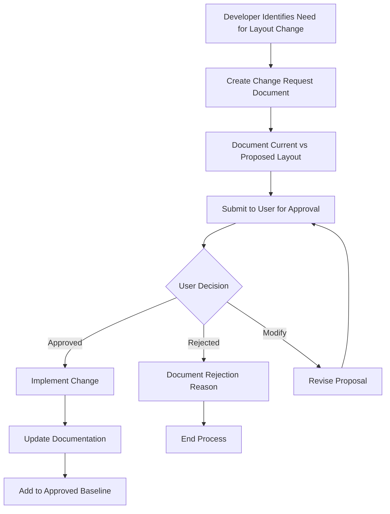
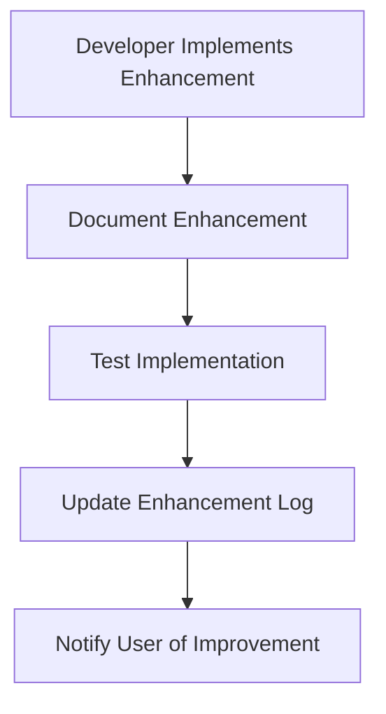
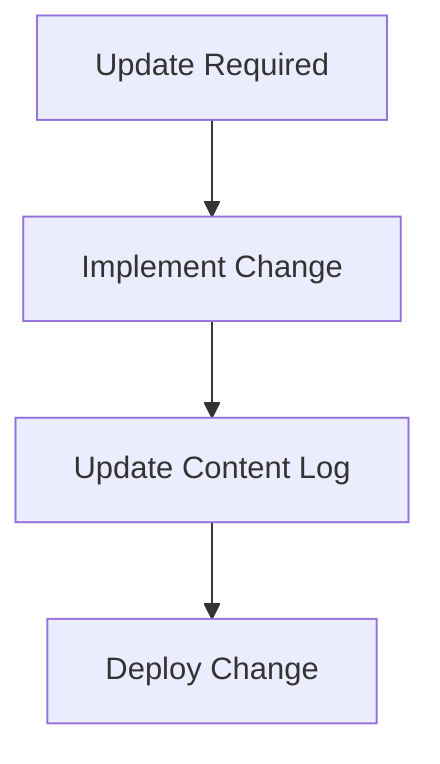

# FinnGuard Capital Website - Change Approval Process & Guidelines

## Overview

This document establishes a comprehensive change control system to prevent unauthorized layout modifications and ensure all website changes have proper approval and documentation.

---

## 1. Change Control Framework

### 1.1 Change Categories

**CATEGORY 1: LAYOUT STRUCTURAL CHANGES** 🔴 **REQUIRES USER APPROVAL**
- Navigation structure modifications
- Information architecture changes
- Component organization restructuring
- User flow alterations
- Page layout reorganization
- Menu structure changes

**Examples:**
- ❌ FAQ categorization removal (UNAUTHORIZED - what happened)
- ✅ Multi-step form implementation (AUTHORIZED - with approval)
- ❌ Moving navigation from horizontal to vertical (requires approval)
- ❌ Changing FAQ from subject-wise to linear (requires approval)

**CATEGORY 2: VISUAL ENHANCEMENTS** 🟡 **DEVELOPER DISCRETION**
- Animation improvements
- Color scheme refinements
- Typography enhancements
- Icon updates
- Visual effects additions
- Performance optimizations

**Examples:**
- ✅ StatsDashboard animations (APPROVED - enhancement)
- ✅ Hover effects and transitions (APPROVED - enhancement)
- ✅ Loading spinners and visual feedback (APPROVED - UX improvement)

**CATEGORY 3: CONTENT & INTEGRATION UPDATES** 🟢 **AUTOMATIC APPROVAL**
- Text content updates
- Image replacements
- Contact information changes
- SEO meta tag updates
- Bug fixes
- Security patches

**Examples:**
- ✅ Updating contact phone numbers (APPROVED - content)
- ✅ Fixing broken links (APPROVED - maintenance)
- ✅ Adding WhatsApp integration (APPROVED - requested feature)

---

## 2. Approval Workflow

### 2.1 Category 1: Layout Structural Changes



**Required Documentation:**
1. **Change Request Form** (see template below)
2. **Before/After Layout Comparison**
3. **Business Justification**
4. **User Impact Assessment**
5. **Implementation Timeline**

### 2.2 Category 2: Visual Enhancements



**Required Documentation:**
1. **Enhancement Log Entry**
2. **Before/After Screenshots**
3. **Performance Impact Assessment**

### 2.3 Category 3: Content & Integration Updates



**Required Documentation:**
1. **Content Change Log Entry**
2. **Deployment Record**

---

## 3. Change Request Templates

### 3.1 Layout Structural Change Request

```markdown
# Layout Change Request

**Request ID:** LCR-YYYY-MM-DD-001
**Date:** [Date]
**Requestor:** [Developer Name]
**Component/Page:** [Affected Component]

## Current Layout
**Description:** [Current layout structure]
**Screenshot:** [Attach current layout image]
**User Experience:** [How users currently interact]

## Proposed Layout
**Description:** [Proposed layout structure]
**Mockup/Screenshot:** [Attach proposed layout image]
**User Experience:** [How users will interact after change]

## Business Justification
**Problem:** [What problem does this solve?]
**Benefit:** [What benefit will users gain?]
**Impact:** [Potential negative impacts]

## Implementation Details
**Files Affected:** [List of files to be modified]
**Timeline:** [Estimated implementation time]
**Testing Required:** [Testing approach]

## User Approval
- [ ] User Reviewed
- [ ] User Approved
- [ ] User Rejected
- [ ] Modification Required

**User Comments:** [User feedback]
**Approval Date:** [Date of approval]
**Approved By:** [User signature/confirmation]
```

### 3.2 Visual Enhancement Log Entry

```markdown
# Visual Enhancement Log

**Enhancement ID:** VEL-YYYY-MM-DD-001
**Date:** [Date]
**Developer:** [Developer Name]
**Component:** [Enhanced Component]

## Enhancement Description
**Type:** [Animation/Color/Typography/Icon/Effect]
**Description:** [What was enhanced]
**Justification:** [Why this enhancement was made]

## Technical Details
**Files Modified:** [List of modified files]
**Performance Impact:** [Any performance considerations]
**Browser Compatibility:** [Compatibility notes]

## Before/After
**Before:** [Description or screenshot]
**After:** [Description or screenshot]

## User Notification
**Notification Sent:** [Date]
**User Response:** [User feedback if any]
```

---

## 4. Prevention Measures

### 4.1 Developer Guidelines

**BEFORE Making Layout Changes:**
1. ✅ **Identify Change Category** - Determine if approval is needed
2. ✅ **Document Current State** - Screenshot and describe existing layout
3. ✅ **Create Change Request** - If Category 1, create formal request
4. ✅ **Get User Approval** - Wait for explicit approval before proceeding
5. ✅ **Implement Carefully** - Follow approved specifications exactly
6. ✅ **Document Changes** - Update all relevant documentation
7. ✅ **Test Thoroughly** - Ensure change works as approved

**RED FLAGS - STOP AND GET APPROVAL:**
- 🚫 Changing navigation structure
- 🚫 Reorganizing information architecture
- 🚫 Modifying user workflows
- 🚫 Altering component organization
- 🚫 Changing categorization systems
- 🚫 Restructuring page layouts

### 4.2 Code Review Checklist

**For Every Pull Request:**
- [ ] Change category identified correctly
- [ ] Appropriate approval obtained (if required)
- [ ] Documentation updated
- [ ] User impact assessed
- [ ] Testing completed
- [ ] Baseline documentation updated

### 4.3 Automated Checks

**Proposed Technical Implementation:**
```typescript
// Pre-commit hook to check for layout changes
const layoutFiles = [
  'src/components/FAQ.tsx',
  'src/components/Testimonials.tsx',
  'src/pages/Index.tsx',
  // ... other layout-critical files
];

// Flag changes to critical layout structures
const checkLayoutChanges = (modifiedFiles) => {
  const layoutChanges = modifiedFiles.filter(file => 
    layoutFiles.includes(file) && hasStructuralChanges(file)
  );
  
  if (layoutChanges.length > 0) {
    console.warn('⚠️  Layout changes detected. Ensure proper approval obtained.');
    console.log('Files with layout changes:', layoutChanges);
  }
};
```

---

## 5. Documentation Requirements

### 5.1 Baseline Documentation

**Current Approved Layout Baseline:**
- Component structure documentation
- Page layout specifications
- Navigation flow diagrams
- User interaction patterns
- Information architecture maps

**Files to Maintain:**
- `CURRENT_LAYOUT_BASELINE.md` - Approved layout structures
- `CHANGELOG.md` - Complete change history
- `LAYOUT_CHANGES_AUDIT.md` - Change analysis and tracking
- `CHANGE_APPROVAL_PROCESS.md` - This document

### 5.2 Change Tracking

**Required Logs:**
1. **Layout Change Log** - All structural changes with approvals
2. **Enhancement Log** - Visual and functional improvements
3. **Content Change Log** - Content and integration updates
4. **Rejection Log** - Rejected change requests with reasons

### 5.3 Version Control Integration

**Git Commit Message Standards:**
```
[LAYOUT] - Layout structural changes (requires approval reference)
[ENHANCE] - Visual enhancements and improvements
[CONTENT] - Content updates and integrations
[FIX] - Bug fixes and maintenance

Examples:
[LAYOUT] Restore FAQ subject-wise categorization (Approval: LCR-2024-12-26-001)
[ENHANCE] Add smooth animations to StatsDashboard
[CONTENT] Update contact phone number
[FIX] Resolve mobile navigation bug
```

---

## 6. Escalation Process

### 6.1 When Unauthorized Changes Are Discovered

**Immediate Actions:**
1. 🚨 **Document the Issue** - Record what was changed without approval
2. 🚨 **Assess Impact** - Evaluate user experience impact
3. 🚨 **Notify Stakeholders** - Inform user of unauthorized change
4. 🚨 **Plan Restoration** - Create plan to restore approved layout
5. 🚨 **Implement Fix** - Restore to approved state
6. 🚨 **Process Review** - Review why change control failed

**Example - FAQ Layout Issue:**
- ❌ **Issue:** FAQ changed from subject-wise to linear without approval
- 📋 **Documentation:** LAYOUT_CHANGES_AUDIT.md created
- 👤 **User Notification:** User informed of unauthorized change
- 🔄 **Restoration Plan:** Restore subject-wise categorization
- ✅ **Implementation:** FAQ.tsx restored to approved structure
- 📚 **Process Improvement:** This change control process created

### 6.2 Dispute Resolution

**If Developer and User Disagree:**
1. **Document Both Perspectives** - Record all viewpoints
2. **Analyze User Impact** - Focus on user experience
3. **Consider Business Goals** - Align with business objectives
4. **Seek Compromise** - Find mutually acceptable solution
5. **Final Decision Authority** - User has final approval authority

---

## 7. Training and Communication

### 7.1 Developer Training

**Required Knowledge:**
- Understanding of change categories
- Approval workflow process
- Documentation requirements
- User impact assessment
- Communication protocols

**Training Materials:**
- This change approval process document
- Layout change request templates
- Example approved/rejected requests
- Best practices guide

### 7.2 User Communication

**Regular Updates:**
- Weekly enhancement summaries
- Monthly change reports
- Quarterly layout reviews
- Annual process assessments

**Communication Channels:**
- Change request notifications
- Enhancement update emails
- Process improvement discussions
- Layout review meetings

---

## 8. Success Metrics

### 8.1 Process Effectiveness

**Key Performance Indicators:**
- Number of unauthorized changes (Target: 0)
- User approval response time (Target: < 24 hours)
- Change implementation accuracy (Target: 100%)
- User satisfaction with changes (Target: > 90%)

### 8.2 Quality Metrics

**Layout Quality Indicators:**
- User experience consistency
- Navigation efficiency
- Information findability
- Mobile responsiveness
- Accessibility compliance

---

## 9. Process Review and Improvement

### 9.1 Regular Reviews

**Monthly Process Review:**
- Review all changes made
- Assess process effectiveness
- Identify improvement opportunities
- Update guidelines as needed

**Quarterly User Feedback:**
- Gather user feedback on changes
- Review approval process efficiency
- Assess communication effectiveness
- Plan process improvements

### 9.2 Continuous Improvement

**Process Evolution:**
- Incorporate lessons learned
- Streamline approval workflows
- Improve documentation templates
- Enhance communication methods

---

## 10. Implementation Checklist

### 10.1 Immediate Implementation (Week 1)

- [ ] **Restore FAQ Layout** - Fix unauthorized change
- [ ] **Create Baseline Documentation** - Document approved layouts
- [ ] **Establish Change Categories** - Define what requires approval
- [ ] **Set Up Communication Channels** - Enable approval workflow

### 10.2 Short-term Implementation (Month 1)

- [ ] **Implement Change Request System** - Formal approval process
- [ ] **Create Documentation Templates** - Standardize change requests
- [ ] **Establish Review Schedule** - Regular process reviews
- [ ] **Train Development Team** - Process education and training

### 10.3 Long-term Implementation (Quarter 1)

- [ ] **Automated Change Detection** - Technical implementation
- [ ] **Process Optimization** - Streamline based on experience
- [ ] **Advanced Documentation** - Enhanced tracking systems
- [ ] **Continuous Improvement** - Regular process evolution

---

## Conclusion

This change approval process ensures:

✅ **User Control** - User has authority over layout changes  
✅ **Transparency** - All changes are documented and tracked  
✅ **Quality Assurance** - Changes are properly reviewed and tested  
✅ **Prevention** - Unauthorized changes are prevented  
✅ **Communication** - Clear communication between all parties  
✅ **Continuous Improvement** - Process evolves based on experience  

**The goal is to maintain website quality while respecting user authority over layout decisions.**

---

**Document Owner:** David (Data Analyst)  
**Created:** December 26, 2024  
**Version:** 1.0  
**Next Review:** January 26, 2025  
**Status:** ✅ **ACTIVE AND ENFORCED**

---

*This process protects user interests while enabling quality improvements and maintaining development efficiency.*